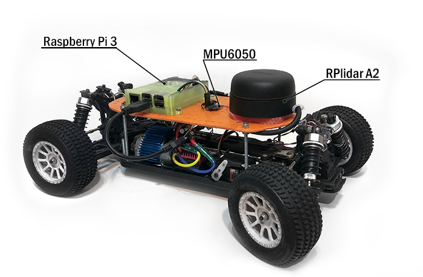

# Autonomous RC vehicle for ROS

This development includes of methods self-driving in indoor environment with used SLAM navigation [rplidar A2](https://www.slamtec.com/en/Lidar/A2#)

### [ROS](http://www.ros.org/) package to control an autonomous RC vehicle based on Raspberry Pi3.



## Configuration:
In current version, the platform has a lidar [rplidar A2](https://www.slamtec.com/en/Lidar/A2#) and gyro [MPU6050](https://playground.arduino.cc/Main/MPU-6050).

## Complite tasks of the project:
* remote controll via ros_node
* [ros_node for remote controll with joystick](https://github.com/turtlebot/turtlebot/tree/kinetic/turtlebot_teleop)
* [hector_mapping](http://wiki.ros.org/hector_mapping) SLAM
* added Imu data from gyroscope MPU6050

## The current tasks of the project:
* add Imu data from flight controller (cc3d)
* write a controller
* add [AMCL](http://wiki.ros.org/amcl)
* add the interception control through the RC remote control (PWM)
* add odometry using optical encoders

## Installation Instructions (Ubuntu)
To install this package with [ROS Kinetic](http://wiki.ros.org/kinetic/Installation/Ubuntu):

1. Install additional system dependencies:

```
sudo apt-get install python-wstool python-catkin-tools ros-indigo-cmake-modules libyaml-cpp-dev
sudo apt-get install ros-kinetic-hector-slam ros-kinetic-map-server ros-kinetic-map-amcl ros-kinetic-map-amcl ros-kinetic-rplidar-ros  ros-kinetic-laser-scan-matcher
```

2. Set up a catkin workspace (if not already done):

```
mkdir -p ~/catkin_ws/src
cd ~/catkin_ws/src
catkin_init_workspace
cd ~/catkin_ws/
catkin_make
echo source devel/setup.bash >> ~/.bashrc  
```

3. Clone repositories (if not already done):

```
cd ~/catkin_ws/src
git clone https://github.com/GigaFlopsis/rc_car_ros.git
cd ~/catkin_ws/
catkin_make
```


