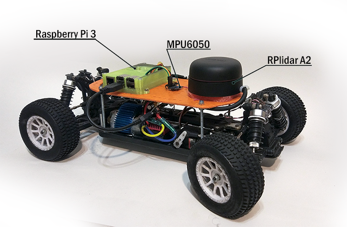

# Autonomous RC vehicle for ROS

### [ROS](http://www.ros.org/) package to control an autonomous RC vehicle based on Raspberry Pi3.

## Configuration:
In current version, the platform has a lidar [rplidar A2](https://www.slamtec.com/en/Lidar/A2#) and gyro [MPU6050](https://playground.arduino.cc/Main/MPU-6050).

## Complite tasks of the project:
* remote controll via ros_node
* [ros_node for remote controll with joystick](https://github.com/turtlebot/turtlebot/tree/kinetic/turtlebot_teleop)
* [hector_mapping](http://wiki.ros.org/hector_mapping) SLAM
* added Imu data from gyroscope MPU6050

## The current tasks of the project:
* add Quaternion from gyroscope to Imu node
* write a controller
* create [gmapping](http://wiki.ros.org/gmapping) navigation
* add [AMCL](http://wiki.ros.org/amcl)
* add the interception control through the RC remote control (PWM)
* add odometry using optical encoders

